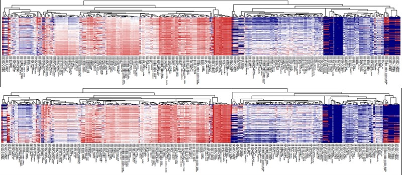

.. role:: raw-html(raw)
    :format: html

========
Features
========

-----------
Data access
-----------
.. _data-access:

**Dataset** is an abstraction of the local file system.
Users can add their local dirs into this system then load data that under these dirs in a convenient way.

XenonPy also uses this system to provide some built-in data.
Currently, two sets of element-level property data are available out-of-the-box (``elements`` and ``elements_completed`` (imputed version of ``elements``)).
These data were collected from `mendeleev`_, `pymatgen`_, `CRC Hand Book`_ and `Magpie`_.

.. _CRC Hand Book: http://hbcponline.com/faces/contents/ContentsSearch.xhtml
.. _Magpie: https://bitbucket.org/wolverton/magpie
.. _mendeleev: https://mendeleev.readthedocs.io
.. _pymatgen: http://pymatgen.org/

``elements`` contains 74 element-level properties of 118 elements. Their missing values
were statistically imputed by performing the multiple imputation method [1]_ and stored as ``elements_completed``.
Because of the statistical unreliability of the imputation for a subset of properties and heavier atoms that contains many missing values in elements,
the ``elements_completed`` data set provides only 58 properties of 94 elements (from **H** to **Pu**). The following table shows the currently available elemental information.

.. table:: Element-level properties

    =================================   ===================================================================================
        feature                             description
    ---------------------------------   -----------------------------------------------------------------------------------
    ``period``                          Period in the periodic table.
    ``atomic_number``                   Number of protons found in the nucleus of an atom.
    ``mendeleev_number``                Atom number in mendeleev's periodic table
    ``atomic_radius``                   Atomic radius.
    ``atomic_radius_rahm``              Atomic radius by Rahm et al.
    ``atomic_volume``                   Atomic volume.
    ``atomic_weight``                   The mass of an atom.
    ``icsd_volume``                     Atom volume in ICSD database.
    ``lattice_constant``                Physical dimension of unit cells in a crystal lattice.
    ``vdw_radius``                      Van der Waals radius.
    ``vdw_radius_alvarez``              Van der Waals radius according to Alvarez.
    ``vdw_radius_batsanov``             Van der Waals radius according to Batsanov.
    ``vdw_radius_bondi``                Van der Waals radius according to Bondi.
    ``vdw_radius_dreiding``             Van der Waals radius from the DREIDING FF.
    ``vdw_radius_mm3``                  Van der Waals radius from the MM3 FF.
    ``vdw_radius_rt``                   Van der Waals radius according to Rowland and Taylor.
    ``vdw_radius_truhlar``              Van der Waals radius according to Truhlar.
    ``vdw_radius_uff``                  Van der Waals radius from the UFF.
    ``covalent_radius_bragg``           Covalent radius by Bragg
    ``covalent_radius_cordero``         Covalent radius by Cerdero et al.
    ``covalent_radius_pyykko``          Single bond covalent radius by Pyykko et al.
    ``covalent_radius_pyykko_double``   Double bond covalent radius by Pyykko et al.
    ``covalent_radius_pyykko_triple``   Triple bond covalent radius by Pyykko et al.
    ``covalent_radius_slater``          Covalent radius by Slater.
    ``c6``                              C_6 dispersion coefficient in a.u.
    ``c6_gb``                           C_6 dispersion coefficient in a.u.
    ``density``                         Density at 295K.
    ``proton_affinity``                 Proton affinity.
    ``dipole_polarizability``           Dipole polarizability.
    ``electron_affinity``               Electron affinity.
    ``electron_negativity``             Tendency of an atom to attract a shared pair of electrons.
    ``en_allen``                        Allen's scale of electronegativity.
    ``en_ghosh``                        Ghosh's scale of electronegativity.
    ``en_pauling``                      Mulliken's scale of electronegativity.
    ``gs_bandgap``                      DFT bandgap energy of T=0K ground state.
    ``gs_energy``                       Estimated FCC lattice parameter based on the DFT volume.
    ``gs_est_bcc_latcnt``               Estimated BCC lattice parameter based on the DFT volume.
    ``gs_est_fcc_latcnt``               Estimated FCC lattice parameter based on the DFT volume.
    ``gs_mag_moment``                   DFT magnetic momenet of T=0K ground state.
    ``gs_volume_per``                   DFT volume per atom of T=0K ground state.
    ``hhi_p``                           Herfindahl−Hirschman Index (HHI) production values
    ``hhi_r``                           Herfindahl−Hirschman Index (HHI) reserves values
    ``specific_heat``                   Specific heat at 20oC.
    ``gas_basicity``                    Gas basicity.
    ``first_ion_en``                    First ionisation energy.
    ``fusion_enthalpy``                 Fusion heat.
    ``heat_of_formation``               Heat of formation.
    ``heat_capacity_mass``              Mass specific heat capacity.
    ``heat_capacity_molar``             Molar specific heat capacity.
    ``evaporation_heat``                Evaporation heat.
    ``linear_expansion_coefficient``    Coefficient of linear expansion.
    ``boiling_point``                   Boiling temperature.
    ``brinell_hardness``                Brinell Hardness Number.
    ``bulk_modulus``                    Bulk modulus.
    ``melting_point``                   Melting point.
    ``metallic_radius``                 Single-bond metallic radius.
    ``metallic_radius_c12``             Metallic radius with 12 nearest neighbors
    ``thermal_conductivity``            Thermal conductivity at 25 C.
    ``sound_velocity``                  Speed of sound.
    ``vickers_hardness``                Value of Vickers hardness test.
    ``Polarizability``                  Ability to form instantaneous dipoles.
    ``youngs_modulus``                  Young's modulus.
    ``poissons_ratio``                  Poisson's ratio.
    ``molar_volume``                    Molar volume.
    ``num_unfilled``                    Total unfilled electron.
    ``num_valance``                     Total valance electron.
    ``num_d_unfilled``                  Unfilled electron in d shell.
    ``num_d_valence``                   Valance electron in d shell.
    ``num_f_unfilled``                  Unfilled electron in f shell.
    ``num_f_valence``                   Valance electron in d shell.
    ``num_p_unfilled``                  Unfilled electron in p shell.
    ``num_p_valence``                   Valance electron in d shell.
    ``num_s_unfilled``                  Unfilled electron in s shell.
    ``num_s_valence``                   Valance electron in d shell.
    =================================   ===================================================================================

For more details on this system, see :doc:`tutorial/1-dataset`.

Access https://github.com/yoshida-lab/XenonPy/blob/master/samples/dataset_and_preset.ipynb to get a runnable script.

**Reference**

.. [1] Rubin DB. Multiple imputation for nonresponse in surveys. New York: Wiley; 1987.

----------------------
Descriptor calculation
----------------------

Compositional descriptors
-------------------------

XenonPy can calculate 290 compositional features for a given chemical composition.
This calculation uses the information of the 58 element-level property data recorded in ``elements_completed``.
For example, let us consider a binary compound, :math:`A_{w_A}B_{w_B}`, whose element-level features are denoted by :math:`f_{A,i}` and :math:`f_{B,i} (i = 1, …, 58)`. Then, the 290 compositional descriptors are calculated: for :math:`i = 1, …, 58`,

* Weighted average (abbr: ave): :math:`f_{ave, i} = w_{A}^* f_{A,i} + w_{B}^* f_{B,i}`,
* Weighted variance (abbr: var): :math:`f_{var, i} = w_{A}^* (f_{A,i} - f_{ave, i})^2  + w_{B}^* (f_{B,i} - f_{ave, i})^2`,
* Max-pooling (abbr: max): :math:`f_{max, i} = max{f_{A,i}, f_{B,i}}`,
* Min-pooling (abbr: min): :math:`f_{min, i} = min{f_{A,i}, f_{B,i}}`,
* Weighted sum (abbr: sum): :math:`f_{sum, i} = w_{A} f_{A,i} + w_{B} f_{B,i}`,

where :math:`w_{A}^*` and :math:`w_{B}^*` denote the normalized composition summing up to one.

Structural descriptors
----------------------
Currently, XenonPy implements RDF (radial distribution function) and OFM (orbital field matrix [2]_) descriptors of crystalline structures.
We also provide a compatible API to use the structural descriptors of `matminer <https://hackingmaterials.github.io/matminer/>`_.
You may check the summary table of featurizers in matminer `here <https://hackingmaterials.github.io/matminer/featurizer_summary.html>`_.

RDKit descriptors
-----------------
XenonPy also supports molecular descriptors available in the `RDKit`_ python package, including 6 sets of fingerprints, each contains corresponding options.

.. _RDKit: https://www.rdkit.org/

The tutorials at :doc:`tutorial/2-descriptor` demonstrate how to calculate descriptors using ``XenonPy.descriptor`` classes.

Access https://github.com/yoshida-lab/XenonPy/blob/master/samples/calculate_descriptors.ipynb to get a runnable script.

**Reference**

.. [2] Pham et al. Machine learning reveals orbital interaction in materials, Sci Technol Adv Mater. 18(1): 756-765, 2017.

--------------------------------------------------
Visualization of descriptor-property relationships
--------------------------------------------------

Descriptors on a set of given materials could be displayed on a heatmap plot in order to facilitate the understanding of
overall patterns in relation to their properties. The following figure shows an example:

     Heatmap of 290 compositional descriptors of 69,640 compounds in Materials Project (upper: volume Å\ :sup:`3`\ , lower:  density g/cm\ :sup:`3`\  ).

In the heatmap of the descriptor matrix, the 69,640 materials are arranged from the top to bottom by the increasing order
of formation energies. Plotting the descriptor-property relationships in this way, we could visually recognize which
descriptors are relevant or irrelevant to the prediction of formation energies. Relevant descriptors, which are linearly
or nonlinearly dependent to formation energies, might exhibit certain patterns from top to bottom in the heatmap. For example,
a monotonically decrease or increase pattern would appear in a linearly dependent descriptor. On the other hand,
irrelevant descriptors might exhibit no specific patterns.

See the tutorials for visualization of descriptor-property relationships at :doc:`tutorial/3-visualization`.

Access https://github.com/yoshida-lab/XenonPy/blob/master/samples/visualization.ipynb to get a runnable script.

-----------
XenonPy.MDL
-----------

XenonPy.MDL is a library of pre-trained models that were obtained by feeding diverse materials data on structure-property relationships into neural networks and some other supervised learning algorithms.
The current release (version 0.1.0) contains more than 100,000 models (include private models) on physical, chemical, electronic, thermodynamic, or mechanical properties of small organic molecules (15 properties), polymers/polymer composites (18), and inorganic compounds (12).
Pre-trained neural networks are distributed as either the R (MXNet) or Python (PyTorch) model objects.
Detailed information about XenonPy.MDL, such as a list of models, properties, source data used for training, and so on, are prepared in this paper [3]_.

The following lists contain the information of current available pre-trained models and properties.

.. table:: Information on model sets

    +-----------+-----------------------------------+-------------------------------------------------------------------+
    |  sId      |  name                             |  description                                                      |
    +===========+===================================+===================================================================+
    |           | | Stable inorganic compounds      | | Models in this set are trained on ~20,000 stable inorganic      |
    |  ``S1``   | | in materials project (MP)       | | compounds selected from the materials project.                  |
    |           |                                   |                                                                   |
    +-----------+-----------------------------------+-------------------------------------------------------------------+
    |           | | All inorganic compounds         | | Models in this set are trained on ~70,000 inorganic compounds   |
    |  ``S2``   | | in materials project (MP)       | | selected from the materials project.                            |
    |           |                                   |                                                                   |
    +-----------+-----------------------------------+-------------------------------------------------------------------+
    |           | | QM9 Dataset from                | | Quantum-Machine project can be access                           |
    |  ``S3``   | | Quantum-Machine website         | | from http://quantum-machine.org/.                               |
    |           |                                   |                                                                   |
    +-----------+-----------------------------------+-------------------------------------------------------------------+
    |           |   PHYSPROP Dataset                | | PHYSPROP database contains chemical structures,                 |
    |  ``S4``   |                                   | | names and physical properties for over 41,000 chemicals.        |
    |           |                                   |                                                                   |
    +-----------+-----------------------------------+-------------------------------------------------------------------+
    |           | | Jean-Claude Bradley Open        | | Jean-Claude Bradley's dataset of Open Melting Points.           |
    |  ``S5``   | | Melting Point Dataset           |                                                                   |
    |           |                                   |                                                                   |
    +-----------+-----------------------------------+-------------------------------------------------------------------+
    |           | | Polymer Genome Dataset (PG)     | | Polymer Genome is an informatics platform for polymer property  |
    |  ``S6``   |                                   | | prediction and design using machine learning.                   |
    |           |                                   | | It can be accessed via https://www.polymergenome.org/.          |
    +-----------+-----------------------------------+-------------------------------------------------------------------+

.. table:: Information of properties

    ================================ =================== ================================================
                                name             system                                    querying name
    -------------------------------- ------------------- ------------------------------------------------
                 Melting Temperature     Organic Polymer              organic.polymer.melting_temperature
                   Ionization Energy     Organic Polymer                organic.polymer.ionization_energy
           Ionic Dielectric Constant     Organic Polymer        organic.polymer.ionic_dielectric_constant
     Hildebrand Solubility Parameter     Organic Polymer  organic.polymer.hildebrand_solubility_parameter
        Glass Transition Temperature     Organic Polymer     organic.polymer.glass_transition_temperature
                        Molar Volume     Organic Polymer                     organic.polymer.molar_volume
                   Electron Affinity     Organic Polymer                organic.polymer.electron_affinity
                 Dielectric Constant     Organic Polymer              organic.polymer.dielectric_constant
                             Density     Organic Polymer                          organic.polymer.density
                     Cohesive Energy     Organic Polymer                  organic.polymer.cohesive_energy
                             Bandgap     Organic Polymer                          organic.polymer.bandgap
                  Atomization Energy     Organic Polymer               organic.polymer.atomization_energy
                    Refractive Index     Organic Polymer                 organic.polymer.refractive_index
                 Molar Heat Capacity     Organic Polymer              organic.polymer.molar_heat_capacity
      Electronic Dielectric Constant     Organic Polymer   organic.polymer.electronic_dielectric_constant
                          U0 Hartree  Organic Nonpolymer                    organic.nonpolymer.u0_hartree
                            R2 Bohr2  Organic Nonpolymer                      organic.nonpolymer.r2_bohr2
                            Mu Debye  Organic Nonpolymer                      organic.nonpolymer.mu_debye
                        Lumo Hartree  Organic Nonpolymer                  organic.nonpolymer.lumo_hartree
                        Homo Hartree  Organic Nonpolymer                  organic.nonpolymer.homo_hartree
                         Gap Hartree  Organic Nonpolymer                   organic.nonpolymer.gap_hartree
                         Alpha Bohr3  Organic Nonpolymer                   organic.nonpolymer.alpha_bohr3
                           U Hartree  Organic Nonpolymer                     organic.nonpolymer.u_hartree
                        Zpve Hartree  Organic Nonpolymer                  organic.nonpolymer.zpve_hartree
                                  Bp  Organic Nonpolymer                            organic.nonpolymer.bp
                      Cv Calmol-1K-1  Organic Nonpolymer                organic.nonpolymer.cv_calmol-1k-1
                                  Tm  Organic Nonpolymer                            organic.nonpolymer.tm
                           G Hartree  Organic Nonpolymer                     organic.nonpolymer.g_hartree
                           H Hartree  Organic Nonpolymer                     organic.nonpolymer.h_hartree
                             Density   Inorganic Crystal                        inorganic.crystal.density
                              Volume   Inorganic Crystal                         inorganic.crystal.volume
                    Refractive Index   Inorganic Crystal               inorganic.crystal.refractive_index
                            Band Gap   Inorganic Crystal                       inorganic.crystal.band_gap
           Dielectric Const Electron   Inorganic Crystal          inorganic.crystal.dielectric_const_elec
                        Fermi Energy   Inorganic Crystal                         inorganic.crystal.efermi
                 Total Magnetization   Inorganic Crystal            inorganic.crystal.total_magnetization
              Dielectric Const Total   Inorganic Crystal         inorganic.crystal.dielectric_const_total
               Final Energy Per Atom   Inorganic Crystal          inorganic.crystal.final_energy_per_atom
           Formation Energy Per Atom   Inorganic Crystal      inorganic.crystal.formation_energy_per_atom
    ================================ =================== ================================================

XenonPy.MDL provides a rich set of APIs to give users the abilities to interact with the pre-trained model database.
Through the APIs, users can search for a specific subset of models by keywords and download them via HTTP.
The tutorials at :doc:`tutorial/5-mdl` will show you how to interact with the database in XenonPy (via the API querying).

Access https://github.com/yoshida-lab/XenonPy/blob/master/samples/mdl.ipynb to get a runnable script.

-----------------
Transfer learning
-----------------

Transfer learning is an increasingly popular framework in machine learning that covers a broad range of methodologies for
which a model trained for one task is re-purposed to another related task [4]_ [5]_.
In general, the need for transfer learning occurs when there is a limited supply of training data, but there are many other
promising applications in materials science as described in [3]_.

XenonPy offers a simple-to-use toolchain to seamlessly perform transfer learning with the given pre-trained models.
Given a target property, by using the transfer learning module of XenonPy, a source model can be treated as a generator of machine learning acquired descriptors, so-called the neural descriptors, as demonstrated in [3]_.

See tutorials at :doc:`tutorial/6-transfer-learning` for learning how to do the frozen feature transfer learning in XenonPy.

Access https://github.com/yoshida-lab/XenonPy/blob/master/samples/transfer_learning.ipynb to get a runnable script.

**Reference**

.. [3] Yamada, H., Liu, C., Wu, S., Koyama, Y., Ju, S., Shiomi, J., Morikawa, J., Yoshida, R. Transfer learning: a key driver of accelerating materials discovery with machine learning, in preparation.
.. [4] Karl, W.; Khoshgoftaar, T. M.; Wang, D. J. of Big Data 2016, 3, 1–40.
.. [5] Chuanqi, T.; Fuchun, S.; Tao, K.; Wenchang, Z.; Chao, Y.; Chunfang, L. arXiv 2018, abs/1808.01974.
