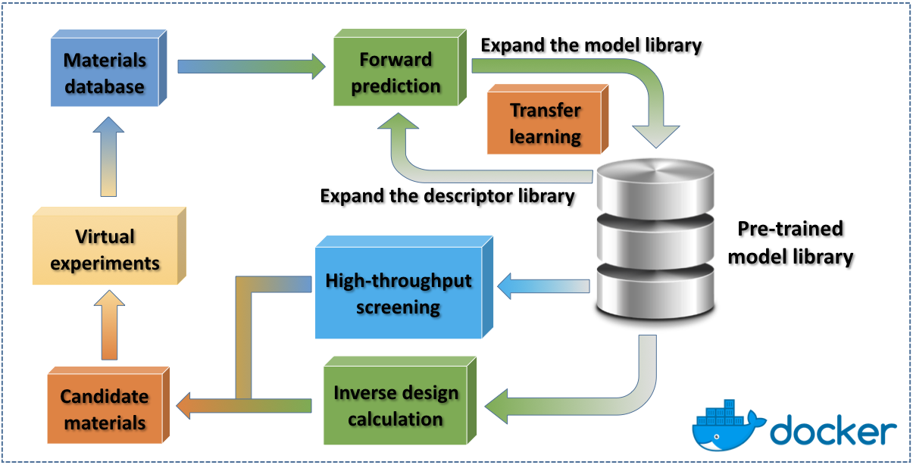

.. Copyright 2019 TsumiNa. All rights reserved.

.. role:: raw-html(raw)
    :format: html

========================
What is XenonPy project
========================

|travis-ci| |cirrus-ci| |appveyor| |codecov| |version| |python| |total-dl| |per-dl|

--------
Overview
--------
**XenonPy** is a Python library that implements a comprehensive set of machine learning tools
for materials informatics. Its functionalities partially depend on Python (PyTorch) and R (MXNet).
This package still under hard working. The current release provides some limited features:

* Interface to the public materials database
* Library of materials descriptors (compositional/structural descriptors)
* pre-trained model library **XenonPy.MDL** (v0.1.0.beta, 2019/8/9: more than 140,000 models (include private models) in 35 properties of small molecules, polymers, and inorganic compounds)
* Machine learning tools.
* Transfer learning using the pre-trained models in XenonPy.MDL

--------
Features
--------
XenonPy has a rich set of tools for various materials informatics applications.
The descriptor generator class can calculate several types of numeric descriptors from ``compositional``, ``structure``.
By using XenonPy's built-in visualization functions, the relationships between descriptors and target properties can be easily shown in a heatmap.

Transfer learning is an important tool for the efficient application of machine learning methods to materials informatics.
To facilitate the widespread use of transfer learning,
we have developed a comprehensive library of pre-trained models, called **XenonPy.MDL**.
This library provides a simple API that allows users to fetch the models via an HTTP request.
For the ease of using the pre-trained models, some useful functions are also provided.

See :doc:`features` for details

------
Sample
------
Some samples are available here: https://github.com/yoshida-lab/XenonPy/tree/master/samples

.. _user-doc:
.. toctree::
    :maxdepth: 2
    :caption: User Documentation

    copyright
    installation
    features
    tutorial
    api
    contribution
    changes
    contact

---------
Reference
---------

.. [1] Yamada, H. et al. Predicting Materials Properties with Little Data Using Shotgun Transfer Learning. ACS Cent. Sci. acscentsci.9b00804 (2019). doi:10.1021/acscentsci.9b00804

------------
Contributing
------------

XenonPy is an `open source project <https://github.com/yoshida-lab/XenonPy>`_ inspired by `matminer <https://hackingmaterials.github.io/matminer>`_.
:raw-html:` `
This project is under on-going development. We would appreciate any feedback from the users.
:raw-html:` `
Code contributions are also very welcomed. See :doc:`contribution` for more details.

.. _pandas: https://pandas.pydata.org
.. _PyTorch: http://pytorch.org/
.. _Xenon: https://en.wikipedia.org/wiki/Xenon

.. |travis-ci| image:: https://travis-ci.org/yoshida-lab/XenonPy.svg?branch=master
    :alt: Build Status
    :target: https://travis-ci.org/yoshida-lab/XenonPy

.. |cirrus-ci| image:: https://api.cirrus-ci.com/github/yoshida-lab/XenonPy.svg?branch=master
    :alt: Build Status
    :target: https://cirrus-ci.com/github/yoshida-lab/XenonPy?branch=master

.. |appveyor| image:: https://ci.appveyor.com/api/projects/status/vnh350xqffp6t9nk/branch/master?svg=true
    :alt: Build Status
    :target: https://ci.appveyor.com/project/TsumiNa/xenonpy

.. |codecov| image:: https://codecov.io/gh/yoshida-lab/XenonPy/branch/master/graph/badge.svg
  :target: https://codecov.io/gh/yoshida-lab/XenonPy

.. |version| image:: https://img.shields.io/github/tag/yoshida-lab/XenonPy.svg?maxAge=360
    :alt: Version
    :target: https://github.com/yoshida-lab/XenonPy/releases/latest

.. |python| image:: https://img.shields.io/pypi/pyversions/xenonpy.svg
    :alt: Python Versions
    :target: https://pypi.org/project/xenonpy/

.. |total-dl| image:: https://pepy.tech/badge/xenonpy
    :alt: Downloads
    :target: https://pepy.tech/badge/xenonpy

.. |per-dl| image:: https://img.shields.io/pypi/dm/xenonpy.svg?label=PiPy%20downloads
    :alt: PyPI - Downloads

