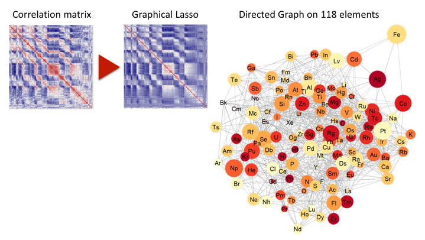
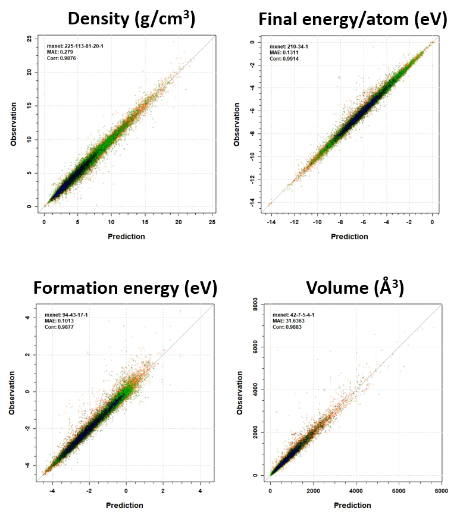

.. Copyright 2017 TsumiNa. All rights reserved.

.. role:: raw-html(raw)
    :format: html

========================
What is XenonPy project
========================
.. image:: https://badges.gitter.im/yoshida-lab/XenonPy.svg
    :alt: Join the chat at https://gitter.im/yoshida-lab/XenonPy
    :target: https://gitter.im/yoshida-lab/XenonPy?utm_source=badge&utm_medium=badge&utm_campaign=pr-badge&utm_content=badge

.. image:: https://travis-ci.org/yoshida-lab/XenonPy.svg?branch=master
    :alt: Build Status
    :target: https://travis-ci.org/yoshida-lab/XenonPy

**XenonPy** is a Python library focus on the material informatics which be designed for material explore based on machine learning.

Why this name
=============

XenonPy named from element Xenon_.
We did a `Graphical Lasso` calculation with our elemental descriptor to find the relationship between elements.
In Bonacich’s centrality calculation, Xenon got the lowest score which means the most isolated element.
This is very interesting because the element's name xenon from the Greek word **ξένος [xenos]** also meaning 'foreign(er)', 'strange(r)', or 'guest'!

Overview
========

The main purpose of this project is to build a complex system to generate various chem/phys descriptors for machine learning and use the results to explore material in virtual environment.
To reach this target, XenonPy planed to provide a lot of modules for:

* Data saving and retrieving.
* Descriptor generating.
* Pre-trained model reusing. such like **transfer learning**.
* Backward prediction.

The final goal of this project is to build a **All-In-One** virtual environment for material development come withe:

* **Massive daataset and Pre-trained models out-of-box**
* **Various methods for descriptor generating and model training**
* **Combined with deep learning methods seamless**
* **Visualization tools for analysis and publish ready**

.. image:: _static/xenonpy.png

XenonPy built on top of pandas_ and PyTorch_ in order to make various downstream machine learning libraries and high-performance NN training.
By use XenonPy(**v0.1.0b**) you can:

* Save and retriever your data in a very simple way by using :py:class:`~xenonpy.datatools.Dataset` and :py:class:`~xenonpy.datatools.Loader`.
* Turn a compound's composition into arrays of numbers representing things such as ``variance``, ``max``, ``min`` etc.
* Calculate pair distribution from compound's structure(:py:class:`pymatget.core.Structure`).
* Draw descriptor heatmap.
* Simple NN model training

.. figure:: _static/heatmap.jpg
    
     Heatmap of 290 compositional descriptors of 69,640 compounds in Materials Project(upper: volume Å\ :sup:`3`\ , lower:  density g/cm\ :sup:`3`\  ).

     Prediction with NN. 290 compositional descriptors of 69,640 compounds was used for traine and test.

XenonPy is a `open source project <https://github.com/yoshida-lab/XenonPy>`_ inspired by `matminer <https://hackingmaterials.github.io/matminer>`_.
This project has just started and a long way to run. We have our plan but very pleased to hear your feedback to make it even better.

Code contributions are also welcomed. See :doc:`contribution` for details.

Sample
======

Some samples available here: https://github.com/yoshida-lab/XenonPy/tree/master/samples

.. _user-doc:
.. toctree::
    :maxdepth: 2
    :caption: User Documentation

    installation
    dataset
    contribution
    contact

Indices and tables
==================
* :ref:`genindex`
* :ref:`modindex`
* :ref:`search`

Copyright and license
=====================
Code and documentation © 2017 TsumiNa.
Released under the `BSD-3 license`_.

.. _pandas: https://pandas.pydata.org
.. _PyTorch: http://pytorch.org/
.. _BSD-3 license: https://opensource.org/licenses/BSD-3-Clause
.. _Xenon: https://en.wikipedia.org/wiki/Xenon
