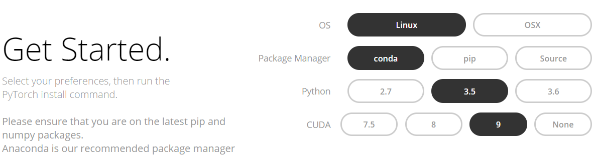

============
Installation
============
XenonPy can be used in Python 3.5 and 3.6.
We have no plane to support Python 2.x (also `pymatgen library will discontinuing Python 2 support from 2018 <http://pymatgen.org/#py3k-only-with-effect-from-2019-1-1>`_).
For some legacy clusters which only come with Python 2.x, a possibility approach is to create an isolated Python 3.5 or 3.6 environment.

XenonPy use PyTorch_ as the NN engine backend because of it's flexibility and high performance.
Since PyTorch has no common installation recipe beacuse it dependent on what your OS is and either use `CUDA <https://developer.nvidia.com/cuda-toolkit>`_.
So unfortunately, you have to install PyTorch manually after the installation of XenonPy.

Let we say:

* :ref:`install_xenonpy` 
* :ref:`install_pytorch`

.. note::

    Installation on Unix-like system is actually quite simple. For windows the installation is relative triviality.
    We highly recommend you to install `Visual C++ Build Tools <http://landinghub.visualstudio.com/visual-cpp-build-tools>`_ before you install other python packages.

.. tip::

    If you got ``fatal error C1083: Cannot open include file: 'basetsd.h': No such file or directory`` error when install via ``pip``.
    Try checked windows 8.1 / 10 SDK options when install Visual C++ Build Tools.

.. _install_xenonpy:

Step1: Install XenonPy
=======================

via anaconda (recommended)
--------------------------
The easiest way to install XenonPy is using conda_. If you don't have conda_ follow the `official installation documents <https://conda.io/docs/user-guide/install/index.html>`_.

We created a channel to build a collection of our materials science software,
If you already have conda installed, XenonPy can be installed from the `yoshida-lab channel`_ using the following one line command:

.. code-block:: bash

   $ conda install --channel yoshida-lab xenonpy

XenonPy is under active development, many new features are added regularly. To
upgrade pymatgen to the latest version, use the following command:

.. code-block:: bash

   $ conda upgrade xenonpy

via pip
--------------------------

If you don't/can't install conda_. A common way is to use pip_.
Simply run the command in a bash terminal:

.. code-block:: bash

    $ pip install xenonpy

or, to install XenonPy in your user home folder, run the command:

.. code-block:: bash

    $ pip install xenonpy --user

To update, simply type

.. code-block:: bash

    $ pip install --upgrade xenonpy

Install in development mode
-----------------------------

To install from the latest source code of the XenonPy from our `Github repository`_, clone the Git source:

.. code-block:: bash

    $ git clone https://github.com/yoshida-lab/XenonPy.git

and then enter the cloned repository/folder to install in developer mode:

.. code-block:: bash

    $ cd XenonPy
    $ pip install -e .

To update XenonPy, enter your cloned folder and type

.. code-block:: bash

    $ git pull
    $ pip install -e .

.. _install_pytorch:

Step2: Install PyTorch
======================

As mentioned above you have to install PyTorch manually. This picture show various combinations of how to install PyTorch.
Please follow the `Get Started` section on the PyTorch_ official sit.

Troubleshooting/Issues
======================

Having issues installing? Contract us at issues_ and Gitter_.

When open issues, please describing your problem in full
(including your system specifications, Python version information, and input/output log).

-----------------------------------------------------------------------------------------------------------

.. _conda: http://conda.pydata.org
.. _yoshida-lab channel: https://anaconda.org/yoshida
.. _pip: https://pip.pypa.io
.. _Github repository: https://github.com/yoshida-lab/XenonPy
.. _issues: https://github.com/yoshida-lab/XenonPy/issues
.. _Gitter: https://gitter.im/yoshida-lab/XenonPy
.. _PyTorch: http://pytorch.org/
