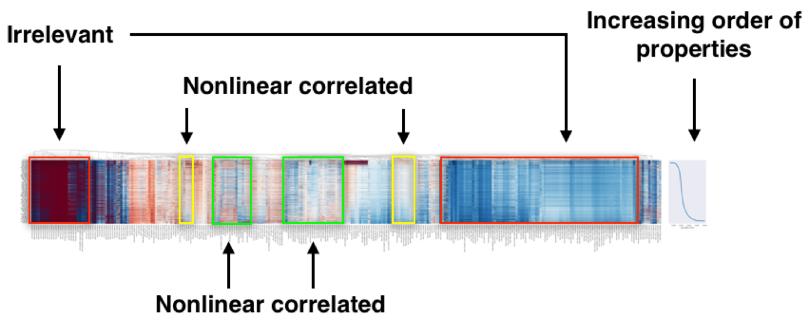

=============
Visualization
=============

Descriptors on a set of given materials could be displayed as a heatmap, which helps you to understand the descriptor-property relationships.
This tutorial will show you how to draw a heatmap.

------------------
Descriptor heatmap
------------------

We will use ``Composition`` and ``density`` as the descriptors and target property, respectively, for a step-by-step demonstration of how to draw a heatmap.

1. calculate descriptors

    .. code-block:: python

        from xenonpy.datatools import preset
        from xenonpy.descriptor import Compositions

        samples = preset.mp_samples
        cal = Compositions()

        descriptor = cal.transform(samples['composition'])

2. sort descriptors by property values

    .. code-block:: python

        # use formation energy as our target
        property_ = 'density'

        # --- sort property
        prop = samples[property_].dropna()
        sorted_prop = prop.sort_values()

        # --- sort descriptors
        sorted_desc = descriptor.loc[sorted_prop.index]

3. draw the heatmap

    .. code-block:: python

        # --- import necessary libraries

        from xenonpy.visualization import DescriptorHeatmap

        heatmap = DescriptorHeatmap(
                bc=True,  # use box-cox transform
                save=dict(fname='heatmap_density', dpi=200, bbox_inches='tight'),  # save fingure to file
                figsize=(70, 10))
        heatmap.fit(sorted_desc)
        heatmap.draw(sorted_prop)

Here, we explain how to *read* the descriptor heatmap.

     Heatmap of ~70,000 compounds with 290 compositional descriptors sorted by their property's value.

In the heatmap of the descriptor matrix, the materials are arranged from the top to bottom in the increasing order
of density. Plotting the descriptor-property relationships in this way, we could visually recognize which
descriptors are relevant or irrelevant to the prediction of formation energies. Relevant descriptors, which are linearly
or nonlinearly dependent to formation energies, might exhibit certain patterns from top to bottom in the heatmap. For example,
a monotonic decrease or increase pattern would appear in a linearly dependent descriptor. On the other hand,
irrelevant descriptors might exhibit no specific patterns.

See the sample code:

    https://github.com/yoshida-lab/XenonPy/blob/master/samples/visualization.ipynb
